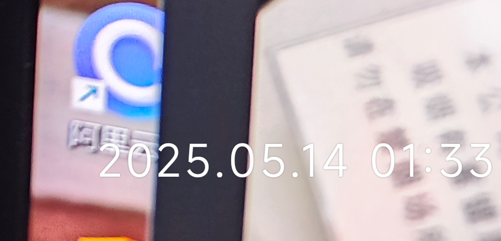
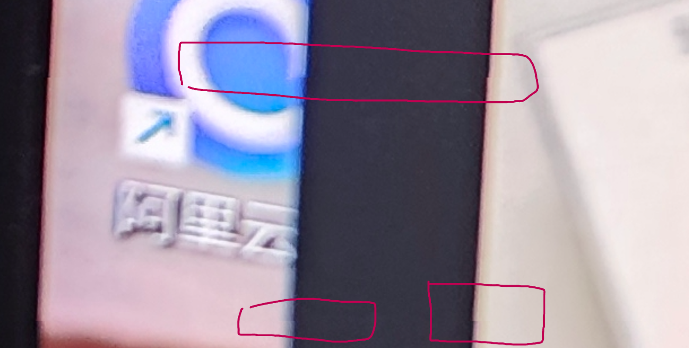
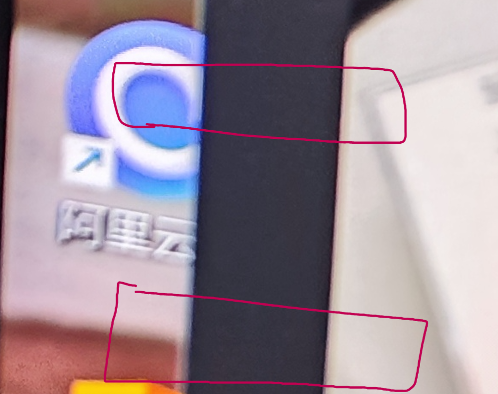

# Xiaomi-Watermark-Remover

[](https://www.python.org/)
[](LICENSE)


## 简介

`Xiaomi-Watermark-Remover` 是一个基于 Python 的命令行工具，用于批量去除小米相机照片的机型水印，并对水印区域进行像素级对齐修复。相比小米官方去除水印的工具，本项目提供更彻底、更精细的修复效果。

* **跨平台支持**：兼容 Windows、macOS、Linux（理论上）。
* **快速批处理**：支持多线程处理，示例测试：30 张图片仅需 2.1 秒。
* **智能识别**：自动区分并处理人像模式和普通模式照片。
* **高精度对齐**：像素级修复，确保恢复后的图片无缝自然。

## 功能特性

* 批量扫描输入目录，递归处理所有符合条件的照片
* 自动跳过 PNG、GIF 等非 JPEG 格式
* 仅支持去除小米默认机型水印，暂不支持徕卡水印
* 多线程加速：CPU 核心数自动检测并发起并行任务
* 处理日志：实时显示进度与统计信息

## 与小米官方对比效果展示

原图 vs 官方去水印后：

 

小米官方去水印 vs 本工具去水印 

 

> 小米官方在去除水印后，在原图被水印覆盖范围会出现像素不对齐的情况，尤其是物体边缘有线性特征时。
> 当然，如果不放大看，肉眼看不出。如图例中，在使用小米官方的相册关闭图像水印后，红色区域直线
> 会有1像素点的偏移。本工具已修复该问题。（time:25.05.20）

## 功能表现（雷氏对比法）

| 测试工具      | 是否支持批量去水印 | 是否像素对齐修复 |
|:----------|:----------|:---------|
| 小米官方相册编辑器 | ❌否        | ❌否        |
| 本工具       | ✅是(包的)     | ✅是        |


## 性能表现

| 测试场景 | 图片数量   | 总耗时   |
| ---- |--------| ----- |
| 本地测试 | 30张混合图 | 2.1 秒 |

> 实际性能因机器配置和图片分辨率而异。当然也受诸如太阳风暴、对象分手、A股下跌等因素影响。

## 安装

1. 克隆仓库：

   ```bash
   git clone https://github.com/yourusername/Xiaomi-Watermark-Remover.git
   cd Xiaomi-Watermark-Remover
   ```

2. 创建并激活虚拟环境（可选）：

   ```bash
   python3 -m venv venv
   source venv/bin/activate   # Linux / macOS
   venv\\Scripts\\activate  # Windows
   ```

3. 安装依赖：

   ```bash
   pip install -r requirements.txt
   ```

4. 或者手动安装`requirements.txt` 依赖内容：

   ```text
   使用阿里云镜像安装：
   
   pip install Pillow==11.2.1 tqdm==4.67.1 -i https://mirrors.aliyun.com/pypi/simple/
   
   或者
   
   pip install Pillow tqdm -i https://mirrors.aliyun.com/pypi/simple/


   ```
## 安装方法2
```text
copy项目里module里的代码和main.py,然后pip安装Pillow和tqdm，就可以了。
（不会真的有人这么做吧，不会吧？）
```

## 使用方法

```bash
usage: remove_watermark.py [-h] [-i INPUT] [-o OUTPUT] [-t THREADS]

可批量去除小米相机机型水印并像素级修复照片

options:
  -h --help            命令帮助信息
  
  -p path, --path PATH
                        必填参数,输入文件夹路径,递归搜索JPEG图片.也支持单个文件输入
                        
  -t THREADS, --threads THREADS
                        非必须参数,并发线程数,默认最大CPU核心数-2
```

示例：

```bash
单文件处理:
python main.py -p C:\Users\userabc\Desktop\you_dir\12.jpg

多文件处理:
python main.py -p C:\Users\userabc\Desktop\you_dir
```

## 支持格式

* **输入**：带有小米标准机型水印的.jpg, .jpeg图片（暂不支持徕卡系水印）
* 
## 输出格式

* **输出**：默认使用原图的量化表输出jpg格式，也就是说理论上去除水印后照片与原图保持一至压缩率。

* **tips**:不过我在compositeNewImg.py约27行注释了png(无损格式)的输出。你可以手动打开，这样就同时输出jpg和无损png图。

## 已知限制

* 仅支持默认小米机型水印，暂不支持徕卡水印。
* 修复效果依赖于清晰的原始图像。
* 不支持在视频或 RAW 文件上操作。
* 不支持恢复HDR图，默认输出SDR图（等更新）。

## 后续计划

* 增加对徕卡水印的识别与去除支持。
* 恢复HDR（LDR）图。

## 许可协议

本项目采用 MIT 许可证，详情请查看 [LICENSE](LICENSE)。
